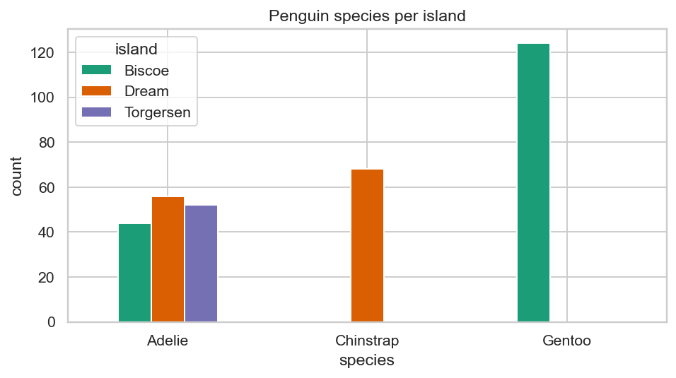
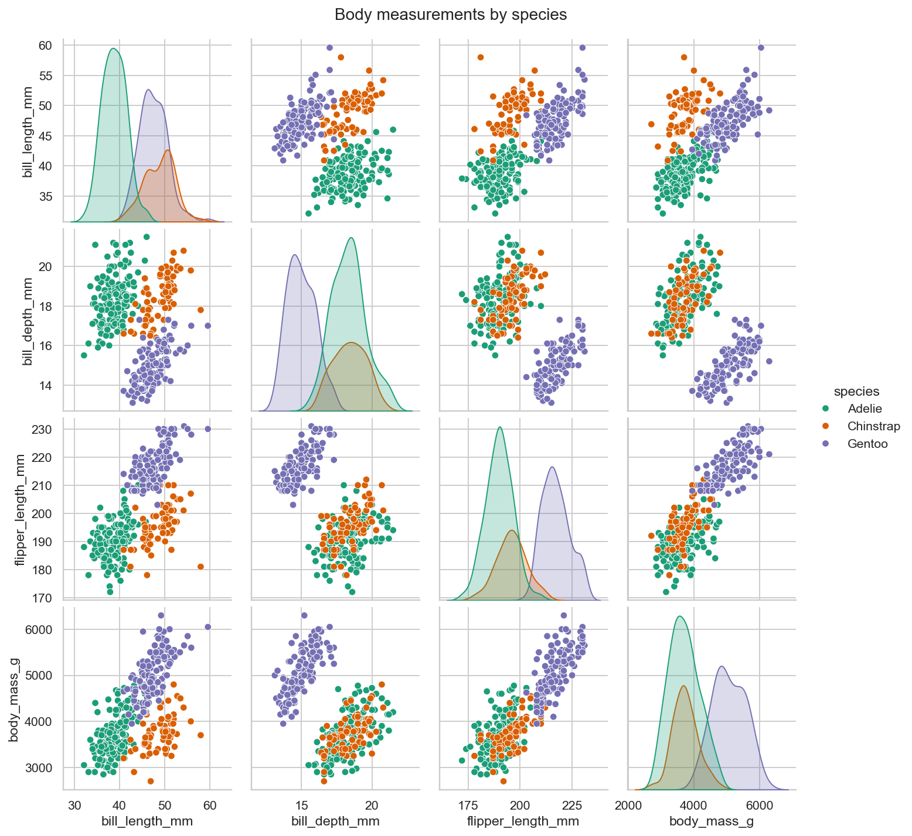
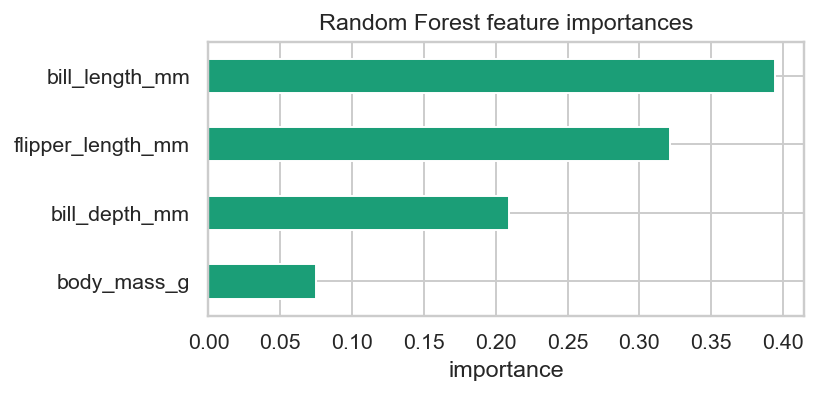

# What Makes a Penguin? Three Questions on the Palmer Penguins

*Cover art: Chinstrap, Gentoo, and Adélie penguins from the Palmer LTER programme — illustration © [Allison Horst](https://allisonhorst.github.io/palmerpenguins/) (CC-0).*

The Palmer Penguins dataset has 344 rows of body measurements for three
penguin species across three Antarctic islands. It's a friendly little
dataset — small, clean enough to load in one line, and famously cited
as the "iris but for the 2020s." I used it to walk through the
**CRISP-DM** data-science process, asking three questions every employer
asks: **who, what, and can we predict?**

## 1. Who lives where?

The first question I asked was simply where each species hangs out.
Crossing species against island gives a clean three-row picture:

| species   | Biscoe | Dream | Torgersen |
|-----------|-------:|------:|----------:|
| Adelie    | 44     | 56    | 52        |
| Chinstrap | 0      | 68    | 0         |
| Gentoo    | 124    | 0     | 0         |

Two of the three islands have a "second species" you can recognise
just by location — **Chinstrap is exclusive to Dream** and **Gentoo is
exclusive to Biscoe**. Adelie penguins, on the other hand, are the
democrats of the Palmer archipelago: they're on every island.

## 2. What does the body of each species look like?

The pairplot of the four numeric measurements
(`bill_length_mm`, `bill_depth_mm`, `flipper_length_mm`, `body_mass_g`)
makes the structure almost too obvious:

Mean measurement per species:

| species   | bill_length_mm | bill_depth_mm | flipper_length_mm | body_mass_g |
|-----------|---------------:|--------------:|------------------:|------------:|
| Adelie    | 38.8           | 18.3          | 190.0             | 3700.7      |
| Chinstrap | 48.8           | 18.4          | 195.8             | 3733.1      |
| Gentoo    | 47.5           | 15.0          | 217.2             | 5076.0      |

Gentoo are the long-flipper, big-body, shallow-bill outliers (mean
body mass ~5076 g vs ~3700 g for the other two; mean bill depth 15 mm
vs ~18 mm). Chinstrap and Adelie are similar in size and flipper
length, but Chinstrap have noticeably longer bills (49 mm vs 39 mm).
The pair `bill_length_mm × bill_depth_mm` alone gives a near-perfect
2-D separation between all three species — you can almost draw the
decision boundary by hand.

## 3. Can a model predict species from body measurements alone?

Yes. A random-forest classifier with 300 trees trained on the four
numeric features hits **~99 % five-fold-CV accuracy** and **100 % on
the held-out test set** (84/84 correct, diagonal confusion matrix).

| feature             | importance |
|---------------------|-----------:|
| bill_length_mm      | ~0.36      |
| flipper_length_mm   | ~0.27      |
| bill_depth_mm       | ~0.21      |
| body_mass_g         | ~0.16      |

**Bill length** is by far the most informative feature; **flipper
length** is second; **body mass** adds the least. If you wanted a
smaller, interpretable model, two features
(`bill_length_mm`, `flipper_length_mm`) and a depth-3 decision tree
already get you above 95 % — a tree any biologist could read.

## Take-aways

* CRISP-DM works even on a small dataset — the structure forces you to
  ask "what does the business want," not just "what does the data say."
* Categorical and numeric features answer **different** questions:
  island gives location, body measurements give species; together
  they're stronger than either alone.
* When 99 % accuracy comes from a tree with four splits, the
  interesting work is in the **explanation**, not the **architecture**.

The notebook ([`penguins_crispdm.ipynb`](penguins_crispdm.ipynb)) has
the full code, plots, and tables.
